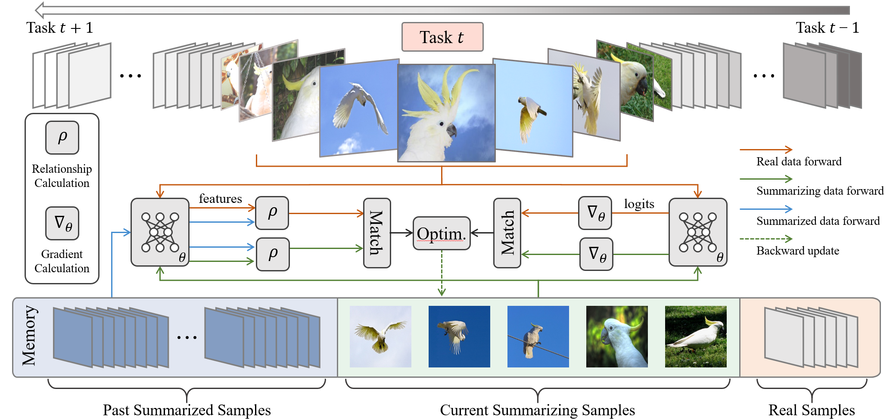

# Summarizing Stream Data for Memory-Restricted Online Continual Learning

Official implementation of "[Summarizing Stream Data for Memory-Restricted Online Continual Learning](https://arxiv.org/abs/2305.16645)"


<p align="center"></p>

## Highlights :sparkles:
- SSD is accepted by AAAI 2024!
- SSD summarizes the knowledge in the stream data into informative images for the replay memory. 
- Through maintaining the consistency of training gradients and relationship to the past tasks, the summarized samples are more representative for the stream data compared with original images. 
- SSD significantly enhances the replay effects for online continual learning methods with limited extra computational overhead.

## Datasets

### Online Class Incremental
- Split CIFAR100
- Split Mini-ImageNet
- Split Tiny-ImageNet

### Data preparation
- CIFAR10 & CIFAR100 will be downloaded during the first run
- Mini-ImageNet: Download from https://www.kaggle.com/whitemoon/miniimagenet/download, and place it in datasets/mini_imagenet/
- Tiny-ImageNet: Download from http://cs231n.stanford.edu/tiny-imagenet-200.zip, place it in datasets/tiny-imagenet-200/, and suppress it into pickles

## Run commands
Detailed descriptions of options can be found in [general_main.py](general_main.py)

### Sample commands to run algorithms on Split-CIFAR100
```shell
python general_main.py --data cifar100 --cl_type nc --agent SSCR --retrieve random --update summarize --mem_size 1000 --images_per_class 10 --head mlp --temp 0.07 --eps_mem_batch 100 --lr_img 4e-3 --summarize_interval 6 --queue_size 64 --mem_weight 1 --num_runs 10
```

## Acknowledgement

This project is mainly based on [online-continual-learning](https://github.com/RaptorMai/online-continual-learning)

## Citation

If you find this work helpful, please cite:
```
@article{gu2023summarizing,
  title={Summarizing Stream Data for Memory-Restricted Online Continual Learning},
  author={Gu, Jianyang and Wang, Kai and Jiang, Wei and You, Yang},
  journal={arXiv preprint arXiv:2305.16645},
  year={2023}
}
```
